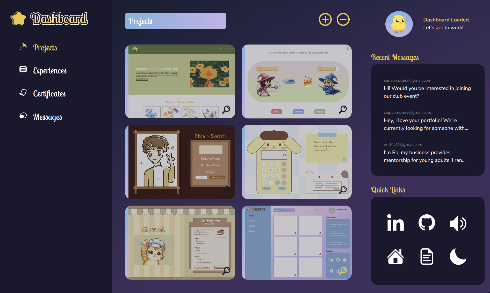

# 🌟 Developer Dashboard  

This is a mockup for my portfolio's backend, built as part of **The Odin Project**.  
I customized and designed it specifically to fit my portfolio’s aesthetic.
The focus of this project was to practice using grid and flex together to create a solid layout.

## ✨ What’s inside  
- Interactive Quick Links section with hover/expand effects  
- Sections for Projects, Certificates, and Experiences
- Built with **CSS Grid** and **Flexbox** for a responsive, clean structure 
- Lo-fi background music toggle for focus and ambiance  
- Light and Dark mode support  
- Works well on desktop and widescreen layouts

## 🖼️ Preview  

## 🧰 Built with  
- Pure **HTML + CSS**  
- **JavaScript** (for interaction logic)
